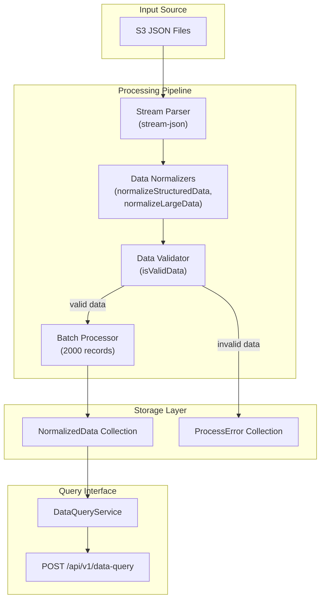

>Core Framework 


>Data Layer


>External Integration 


## 📚 Table of Contents

- [🚀 About](https://github.com/fabian-gl/data-ingest?tab=readme-ov-file#--about)
- [📊 Visual Overview](https://github.com/fabian-gl/data-ingest?tab=readme-ov-file#--visual-overview)
- [🧠 Core Capabilities](https://github.com/fabian-gl/data-ingest?tab=readme-ov-file#--core-capabilities)
- [🔄 Data Processing Features](https://github.com/fabian-gl/data-ingest?tab=readme-ov-file#--data-processing-features)
- [⚙️ Project Setup](https://github.com/fabian-gl/data-ingest?tab=readme-ov-file#%EF%B8%8F--project-setup)
- [🔧 Compile and 🏃‍♂️ Run the Project](https://github.com/fabian-gl/data-ingest?tab=readme-ov-file#--compile-and-%EF%B8%8F-run-the-project)
- [🌐 Network Setup](https://github.com/fabian-gl/data-ingest?tab=readme-ov-file#--network-setup)
- [🐳 Docker Setup](https://github.com/fabian-gl/data-ingest?tab=readme-ov-file#--docker-setup)
- [🔌 API Endpoints](https://github.com/fabian-gl/data-ingest?tab=readme-ov-file#--api-endpoints)
- [✅ Verification Steps](https://github.com/fabian-gl/data-ingest?tab=readme-ov-file#--verification-steps)

---
## 🚀 | About
This project automatically **collects data** from external sources,
*processes and standardizes* it, and then **stores** it in a database.
It also provides an API to *search and retrieve* the stored data.
Essentially, it's a system for **ingesting, normalizing, and querying** structured data.

## 📊 | Visual Overview


## 🧠 | Core Capabilities
The system provides four primary capabilities:

|   Capability   |Implementation                 |Access Method                |
|----------------|-------------------------------|-----------------------------|
|**Automated Data Ingestion**|`CronService` with daily scheduling            |Automatic at midnight           |
|**Manual Data Ingestion** |`DataIngestController` endpoint |`POST /api/v1/data-ingest`    |
|**Data Querying**         |`DataQueryController` with filtering|`POST /api/v1/data-query`|
|**API Documentation**     |  Swagger integration|`GET /docs`|


## 🔄 | Data Processing Features
- Stream Processing: Uses `stream-json` for efficient handling of large JSON files
- Data Normalization: Converts multiple input formats into unified normalized data
- Batch Operations: Processes data in 2000-record batches for optimal performance
- Error Handling: Dedicated `ProcessError` collection for tracking failed operations
- Validation: Comprehensive data validation before persistence

## ⚙️ | Project Setup

```bash
$ npm install
```

## 🔧 | Compile and 🏃‍♂️ Run the Project

Copy the .env.example to a .env file and complete with your environment values

```bash
# development 
$ npm run start 
# watch mode 
$ npm run start:dev 
# production mode 
$ npm run start:prod
```

## 🌐 | Network Setup
The application requires a Docker network for container communication. Create the network before starting the services:

```bash
docker network create data-ingest-network
```
This network is referenced in `docker-compose.yaml` and allows the application container to communicate with the MongoDB container.


## 🐳 | Docker Setup
Start the complete system with a single command:

```bash
docker compose up -d
```
This command will:

>- Build the application image using the multi-stage ´Dockerfile´
>- Start the MongoDB container with the mongo:6 image
>- Start the NestJS application container
>- Establish network connectivity between containers

The data ingest will be done every day at midnight with a cron job. For testing puposes, an endpoint was made available to run it on demand.

>Once the application is running, access the Swagger documentation at:

```bash
http://localhost:3000/docs 
```
>The Swagger interface is configured in src/main.ts with the title "Ingest data" and provides interactive documentation for all available API endpoints.

## 🔌 | API Endpoints
The application exposes REST endpoints under the global prefix /api/v1/ as configured in `src/main.ts`
 Key endpoints include:

|   Endpoint     |         Method                |      Purpose                |
|----------------|-------------------------------|-----------------------------|
|`/api/v1/data-ingest`|POST        |Manual data ingestion trigger          |
|`/api/v1/data-query `|POST|Query normalized data with filters   |
|`/docs`       |GET|Swagger API documentation|


> 📝 Notes about search:
It is possible to search properties by id, city, country, availability, priceSegment, or price per night range.
Also it is possible to search for a property name that will be case and diacritic insensitive.

## ✅ | Verification Steps
1_Container Status Check
> Verify both containers are running:
```bash
docker-compose ps
```

2_Application Health Check
> Test the application responds to requests:

```bash
curl http://localhost:3000/docs
```
This should return the Swagger documentation HTML page.


